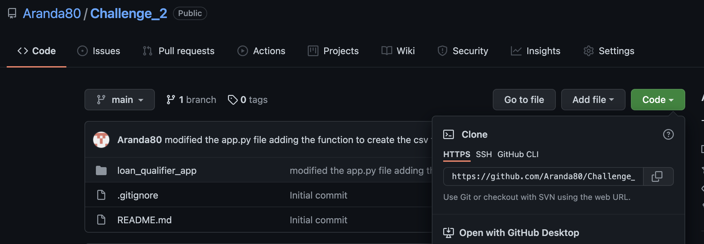
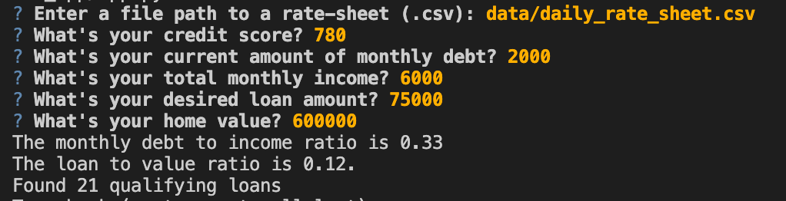

# Loan Finder Application

This application was created to simplify the search of a new qualifying loans. Loan Finder enables the user to obtain information about loans that they are elegible for, using information from a pool of lenders contained in a csv sheet, and asking the user questions to establish their eligibility for the loans. The result is a list with the qualifying loan details, which they can use to easily compare which one is better and more convinient for them in a matter of seconds.

---

## Technologies

This application uses python 3.7.11 and the following packages:

* **[fire](https://github.com/google/python-fire)** - For the line interface, and data entry.

* **[questionary](https://github.com/tmbo/questionary)** - For user prompts and dialogs


---

## Installation Guide

* Please install the following before using the application:

```python
  pip install fire
  pip install questionary
```

---

## Usage

### *To use the Loan Finder application, you can follow these steps:*

**Step 1:** 

- Clone the repository in GitHub on your local drive. You can find the link here:



- From your terminal run:

```
git clone <clone HTTPS link>
```


**Step 2:** Run the **app.py** file:

```python
python app.py
```


- The user will then be asked the following questions to obtain their data:





- Lastly, the user will be asked if they want to save the qualifying loan information in a csv file for their analysis:


---

## Contributors

Jaime Aranda


Firas Obeid


University of Washington FinTech team


---

## License

MIT
